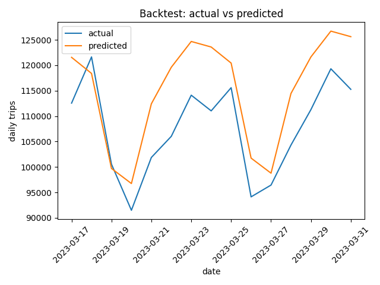
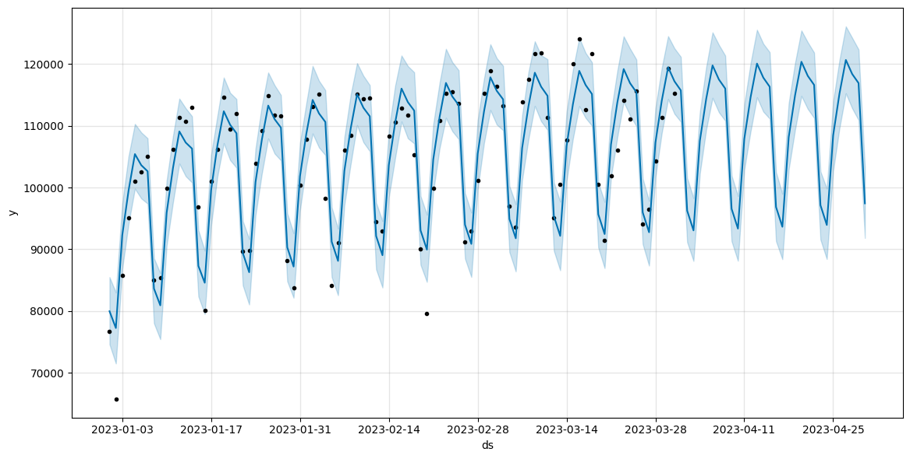

# Fleet Demand Forecasting (Prophet)

Forecast daily fleet demand using public transportation trip data and time-series modeling with Prophet.  
This project demonstrates an end-to-end, production-style analytics workflow:

**data acquisition → aggregation → forecasting → evaluation**

---

## Problem Statement

Fleet and operations teams need accurate short-term demand forecasts to support:
- capacity planning
- driver and vehicle scheduling
- operational budgeting

This project focuses on producing a **reliable daily demand signal** and a **30-day forward forecast** using historical trip data.

---

## Data

Public NYC Yellow Taxi trip records (NYC Open Data).

- Raw event-level trip data (millions of records)
- Aggregated into a **daily time series**:
  - `ds`: date
  - `y`: total trips per day

The raw data is **not committed** to the repository.  
All processing is fully reproducible via the pipeline.

---

## Methodology

1. **Data ingestion**
   - Download raw trip timestamps via the Socrata API
   - Paginated requests to handle large volumes safely

2. **Feature engineering**
   - Aggregate trip events into daily demand counts
   - Produce a clean `(ds, y)` time series suitable for forecasting

3. **Modeling**
   - Prophet time-series model
   - Weekly seasonality enabled
   - 30-day forecast horizon

4. **Evaluation**
   - Time-based backtest
   - Train: first 75 days (chronological)
   - Test: last 15 days (holdout)
   - Metrics: MAE and MAPE

---

## Results (Backtest)

**Evaluation metrics (15-day holdout):**
- **MAE:** ~7,911 daily trips  
- **MAPE:** ~7.33%

These results indicate the model captures weekly demand patterns well and provides actionable short-term forecasts suitable for operational planning.

### Backtest Performance

Actual vs predicted daily demand on a 15-day holdout period:



### 30-Day Demand Forecast

Prophet forecast showing expected demand and uncertainty bounds:



### Artifacts
- Forecast plot: `reports/figures/prophet_forecast.png`
- Component analysis: `reports/figures/prophet_components.png`
- Backtest comparison: `reports/figures/backtest_actual_vs_pred.png`
- Metrics CSV: `reports/metrics/backtest_metrics.csv`

---

## Project Structure

```
.
├── src/
│   ├── download.py          # Data ingestion (API + pagination)
│   ├── build_timeseries.py  # Daily aggregation
│   ├── model_prophet.py     # Training + forecasting
│   └── evaluate.py          # Backtesting + metrics
├── data/
│   ├── raw/                 # Ignored (generated locally)
│   └── processed/           # Aggregated outputs
├── reports/
│   ├── figures/             # Forecast & evaluation plots
│   └── metrics/             # Backtest metrics
└── README.md
```

---

## How to Run

From the project root:

```bash
python -m src.download
python -m src.build_timeseries
python -m src.model_prophet
python -m src.evaluate
```

---

## Notes

* All paths are resolved relative to the project root for reproducibility.
* Raw data is excluded from version control by design.
* The pipeline structure is intentionally modular to support future extensions
  (e.g., feature enrichment, model tuning, or alternative forecasters).

---

## Future Work
- Hyperparameter tuning and holiday effects
- Cross-validation over rolling windows
- Comparison with alternative models (ARIMA, XGBoost, LSTM)
- Integration into a scheduled or orchestrated workflow

---

## Key Takeaways
- Demand exhibits strong and stable weekly seasonality
- Prophet provides stable short-term forecasts with ~7% MAPE
- Suitable for operational planning and capacity decisions
